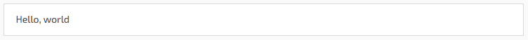
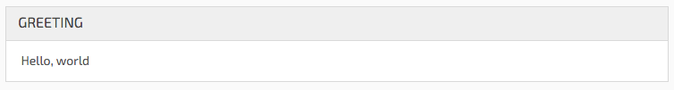
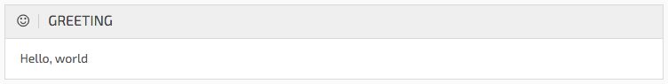
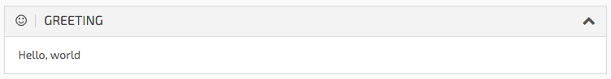
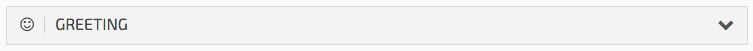
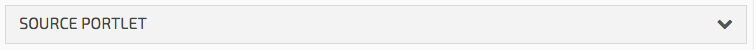
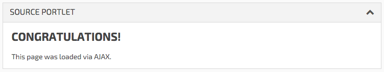
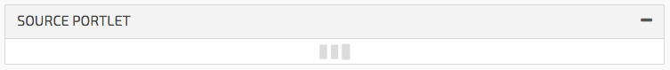

# pure-admin-rails

[](https://travis-ci.org/blaknite/pure-admin-rails)

Pure CSS Admin Template for Rails 4+.

Forms work with SimpleForm, breadcrumbs with crummy.

## Installation

Add these lines to your Gemfile
```ruby
# Admin theme + dependencies
gem 'pure-admin-rails', github: 'blaknite/pure-admin-rails', branch: 'master'
gem 'pure-css-reset-rails', github: 'blaknite/pure-css-reset-rails', branch: 'master'
gem 'exo2-rails', github: 'blaknite/exo2-rails', branch: 'master'
gem 'crummy', github: 'blaknite/crummy', branch: 'master'
gem 'font-awesome-rails'
gem 'select2-rails'
gem 'pure-css-rails'
```

Run
```console
rails generate pure_admin:layout
rails generate pure_admin:simple_form
```

Then edit ```app/views/layouts/admin.html.erb``` to your liking.

## Dependencies

- Pure CSS
- jQuery
- waypoints.js
- [Select2](https://select2.github.io/)

## Usage

### Portlets

Portlets are optionally collapsable containers that can be passed a block, or a source URL.

#### Simple Portlets

The simplest incarnation of a portlet is,
```erb
<%= portlet do %>
  <p>Hello, world</p>
<% end %>
```


You may also give a title to portlets.
```erb
<%= portlet 'Greeting' do %>
  <p>Hello, world</p>
<% end %>
```


Titles can have [icons](https://fortawesome.github.io/Font-Awesome/icons/), too.
```erb
<%= portlet 'Greeting', icon: 'hand-peace-o' do %>
  <p>Hello, world</p>
<% end %>
```


To make a portlet collapsable, add the `expand: true` option to the `portlet` method.
```erb
<%= portlet 'Greeting', icon: 'hand-peace-o', expand: true do %>
  <p>Hello, world</p>
<% end %>
```


If you want the portlet to be collapsed by default, simply add `expand: false` instead.


Any other options that can be passed to Rails' `content_tag` are respected on the portlet too, for example:

```erb
<%= portlet 'Greeting', class: 'is-supported' do %>
...
<%= portlet 'Greeting', data: { attributes: 'are-too' } do %>
...
```

#### Source Portlets

Source portlets are given a source URL which, when expanded, will fetch the content at this URL and display it within the portlet body.

Source portlets require a title be given, to give the user somewhere to click to expand.

For this example, the following file was created:
```html
<!-- public/test.html -->
<h2>Congratulations!</h2>
<p>This page was loaded via AJAX.</p>
```

```erb
<%= portlet 'Source Portlet', source: '/test' %>
```


When the portlet is clicked, the content at the source URL will be retrieved and displayed in the body.


If the AJAX request begins to take too long, the portlet will assume a loading state.


Like Simple Portlets, Source Portlets can be expanded by default.
The difference however, is that this loading happens when the document is ready.
To enable this, simply add the familiar `expand: true` to the options.
```erb
<%= portlet 'Source Portlet', source: '/test', expand: true %>
```

You can additionally expand a portlet via the URL string.
If you add a class to the portlet you can then target this with a hash at the end of your URL.
When this is loaded, a portlet with a class that is the same as the hash will be expanded.

```erb
<%= portlet 'Source Portlet', source: '/test', class: 'source-test' %>
```

```console
http://localhost:3000/{page}#source-test
```
